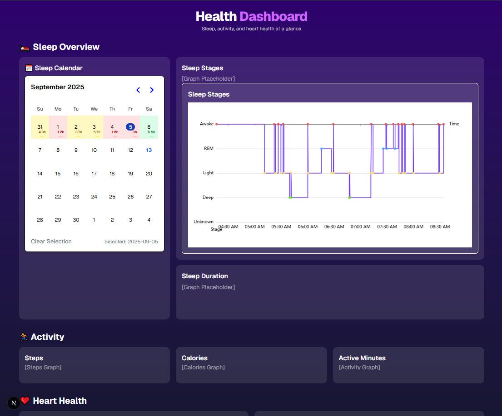

# Health Dashboard

A self-hosted dashboard for health metrics collected from phones and wearables. It provides daily and long-term views of sleep, steps, calories, resting heart rate, and weight. When API credentials are absent, the app intentionally uses its bundled demo dataset.

## Architecture and data flow

The application uses a one-way flow with explicit boundaries:

```text
Health Connect API -> repository/DTO validation -> domain model
    -> server snapshot -> client provider -> selectors -> UI widgets
                       <- user actions ---------|
```

- `src/domain` contains provider-independent health models and calculations.
- `src/server/health` owns external I/O. Repositories translate and validate external payloads with Zod.
- `src/features/health` owns client state, user actions, and derived selectors.
- `src/components` renders domain data and dispatches actions; it does not know the backend response format.

The server renders the initial snapshot, and the client refreshes it through `/api/health` every 60 seconds. A refreshed snapshot follows the same reducer and selector path as the initial data, so widgets update without bespoke synchronization code.

New data sources should implement `HealthRepository`. New metrics should first be added to `HealthSnapshot`, then mapped at the repository boundary, exposed through a selector, and finally rendered by a component. This keeps backend changes from spreading through the UI.

The non-destructive reconciliation of observations from multiple devices is documented in [Health data model](docs/health-data-model.md).

The independently runnable analytics subsystem is documented in [Health analytics pipeline](pipeline/README.md).

Roadmap:

- [x] Implement a calendar view for sleep data - 2025-05-07
- [x] Docker support for easy deployment - 2025-06-28
- [x] Allow users to click on a day in the calendar to view detailed sleep data
- [x] Represent multiple daily sleep sessions and allow switching between them
- [x] Add activity, calorie, resting-heart-rate, and weight analytics
- [x] Add daily health summaries and reusable metric detail pages
- [x] Add year heatmaps, rolling trends, and monthly views
- [x] Add configurable rolling sleep-debt analytics and persistence
- [x] Add versioned sleep-consistency analytics and persistence
- [ ] Add persistence, scheduled imports, and historical aggregation

Dashboard Screenshot:


## Tech Stack

The following technologies are used in this project:

- Create T3 App
  - [Next.js](https://nextjs.org)
  - [Tailwind CSS](https://tailwindcss.com)

# Deployment

## Environment Variables

Use docker compose to set environment variables with the following example:

```yaml
services:
  dashboard:
    image: lucaslad5275/hc-dashboard:1.0
    container_name: health-connect-dashboard
    ports:
      - "3000:3000"
    environment:
      - API_USERNAME=EDIT_ME
      - API_PASSWORD=EDIT_ME
      - API_URL=http://192.168.8.EDIT_ME:6644
    restart: unless-stopped
```

### OR

Create a `.env` file in the root directory of the project with the following content. If these values are omitted, demo data is used.

```
API_USERNAME=your_username
API_PASSWORD=your_password
API_URL=http://your-health-connect-api:6644
```

## Building and Running the Dashboard

_Make sure you have Docker installed on your machine._

Run the following command to build the Docker image for the dashboard:

```bash
docker build -t lucaslad5275/hc-dashboard:1.0 .
```

Run the following command to start the Docker container:

```bash
docker run -p 3000:3000 lucaslad5275/hc-dashboard:1.0
```

### OR

```bash
docker-compose up -d
```
